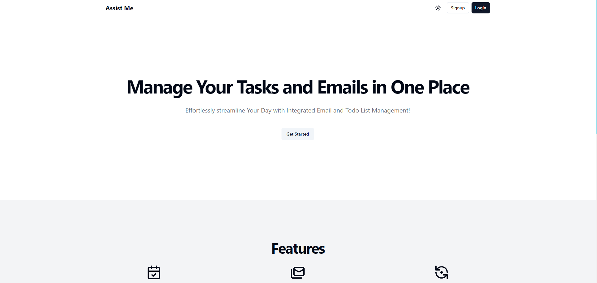
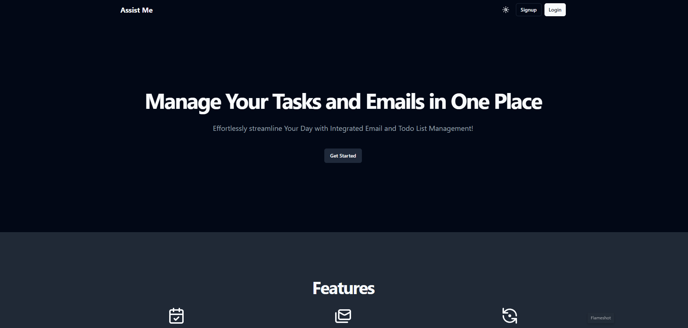
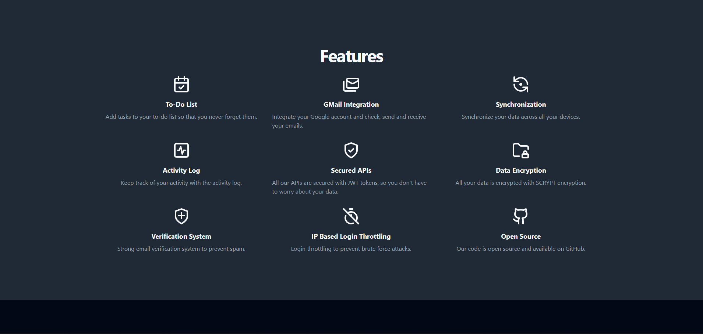
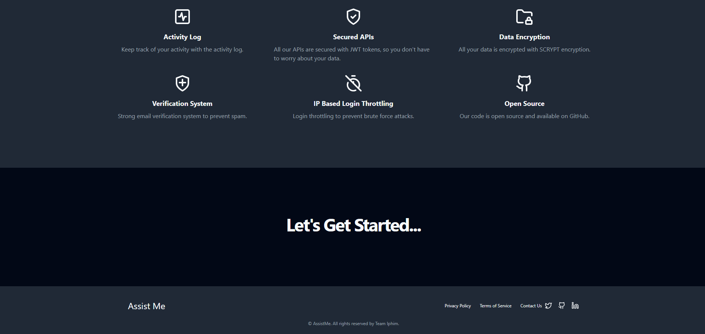
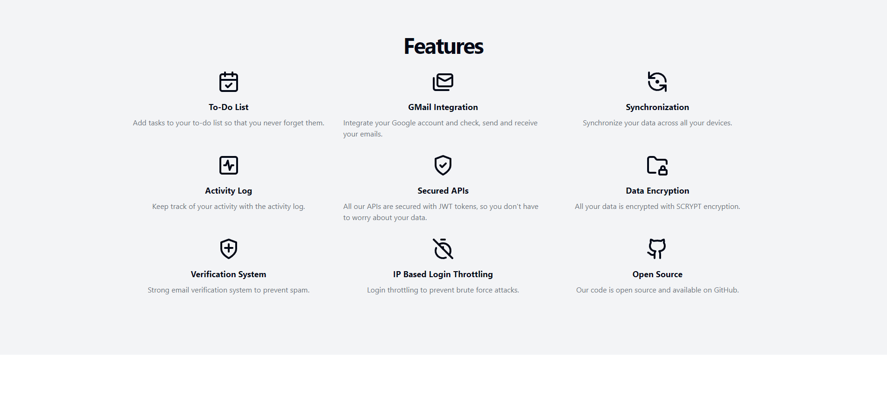
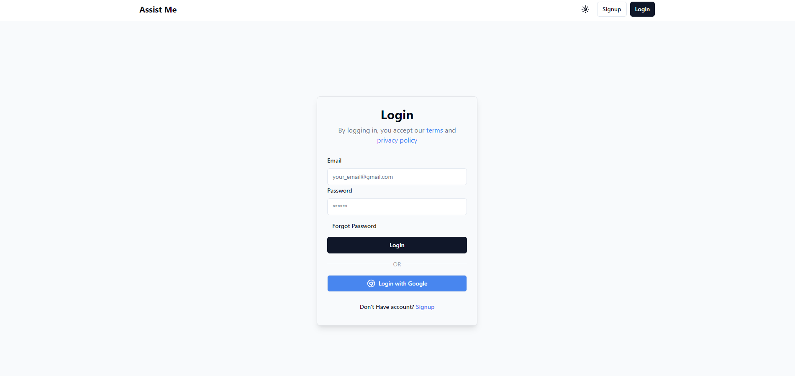
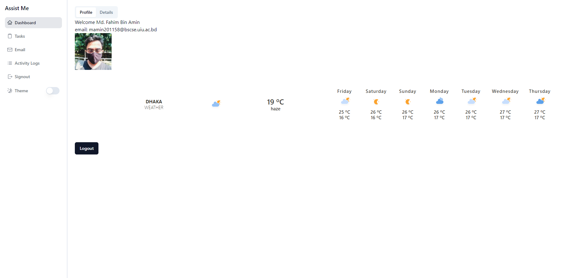
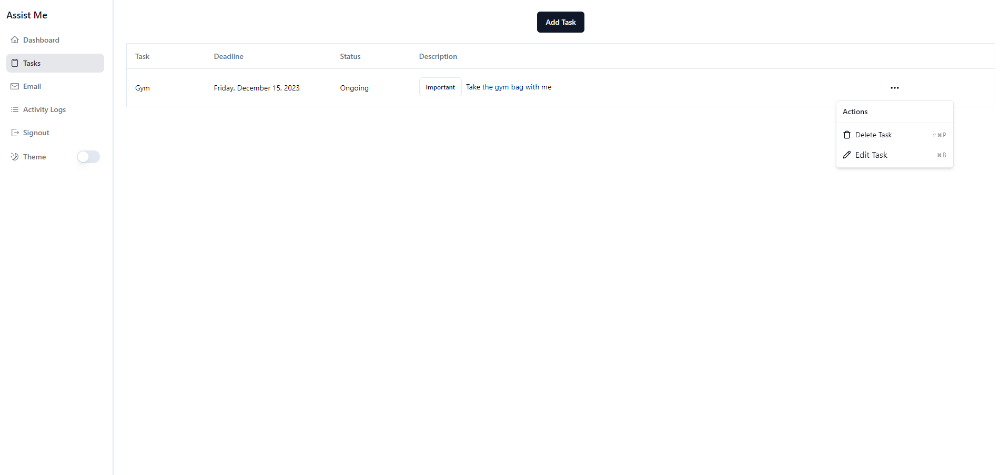
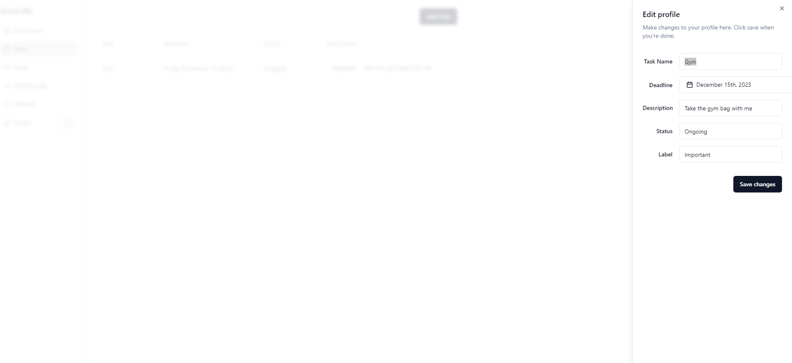
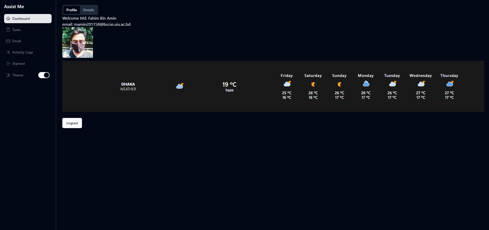

# AssistMe

Effortlessly streamline Your Day with Integrated Email and Todo List Management!

### Don't forget to ⭐ the repository.



Let's see how it looks in dark mode.




<details>
<summary>More screenshots ?</summary>
<br>












</details>


## Feature

- [x] Register/Login with Email and Password
- [x] Register/Login with Google
- [x] Email Verification and Password Reset
- [x] Todo List Management
- [x] Email Management
- [x] Weather Forecast
- [x] Device Synchonization
- [x] Data Encryption
- [x] Secured APIs
- [x] Activity Log
- [x] User Profile
- [x] Timeout Implementation Based on IP Address
- [x] Dark Mode/Light Mode 


## Tech Stack

- ReactJS
- NodeJS
- Tailwind CSS
- Firebase

## Installation

### Prerequisites

- NodeJS
- NPM
- Firebase CLI
- Tailwind CSS
- Git
- VS Code
- Chrome

### Steps

1. Clone the repository

```bash
git clone https://github.com/FahimFBA/assist-me.git
```

2. Install dependencies

```bash
cd assist-me
npm install
```

3. Create a Firebase Project and add your own environment variables in `.env` file.
4. Run the app

```bash
npm start
```

## Contributing

Pull requests are welcome. For major changes, please open an issue first to discuss what you would like to change.

## License

[](LICENSE)